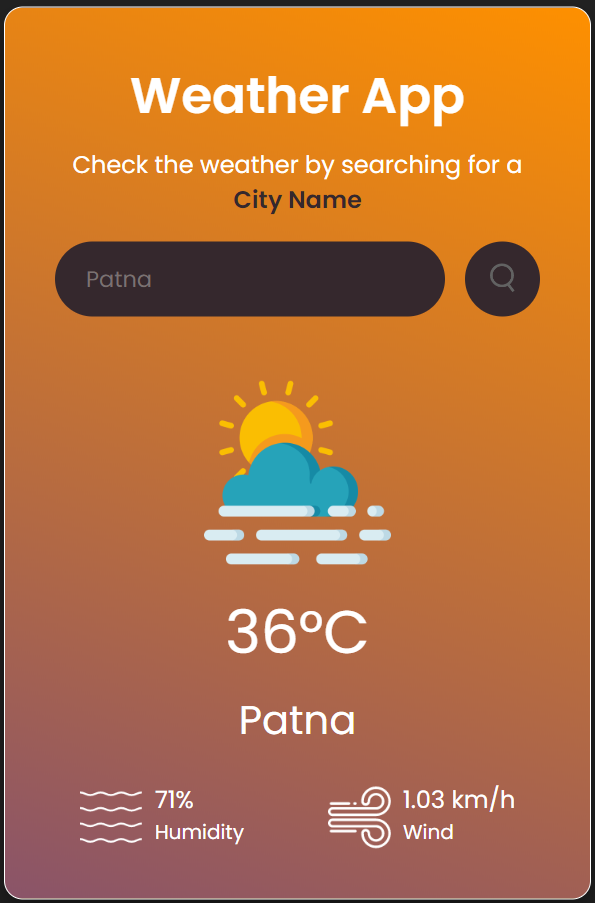

# 🌦️ Responsive Weather WebApp

This responsive web application, developed with **HTML**, **CSS**, and **JavaScript**, provides real-time weather information. It integrates with a weather API to display current conditions and forecasts in a user-friendly interface that seamlessly adapts across desktop, tablet, and mobile devices.

---

## 📸 Screenshots



*Main dashboard displaying current weather conditions in Patna.*

---

## 🌐 Live Demo

Explore the live demo [here](https://weather-webapp-by-manish.netlify.app/).

---

## 📖 About

Responsive Weather WebApp delivers instant access to up-to-date weather data through a modern, adaptable interface. It enhances user experience by presenting weather information clearly and intuitively, ensuring accessibility on any device.

---

## 🌟 Features

- **Real-time weather updates**
- **Location-based weather data**
- **Responsive design for seamless user experience across devices**

---

## 🚀 Installation

To set up the project locally, follow these steps:

```bash
# Clone the repository
git clone https://github.com/manishkmr49/Responsive-Weather-WebApp.git

# Navigate into the project directory
cd Responsive-Weather-WebApp

---

## 📘 Usage

To use the web app, enter a location to view current weather conditions and forecasts. The interface is designed to be intuitive and easy to navigate.

---

## 🤝 Contributing

We welcome contributions! If you would like to contribute to this project, please follow these steps:

1. Fork the repository
2. Create a new branch (`git checkout -b feature`)
3. Make your changes
4. Commit your changes (`git commit -am 'Add new feature'`)
5. Push to the branch (`git push origin feature`)
6. Submit a pull request

---

## 📜 License

This project is licensed under the MIT License.

---

## 💡 Acknowledgements

We acknowledge the following libraries and APIs used in this project:

- Weather API
- Any additional resources or contributors you want to acknowledge
